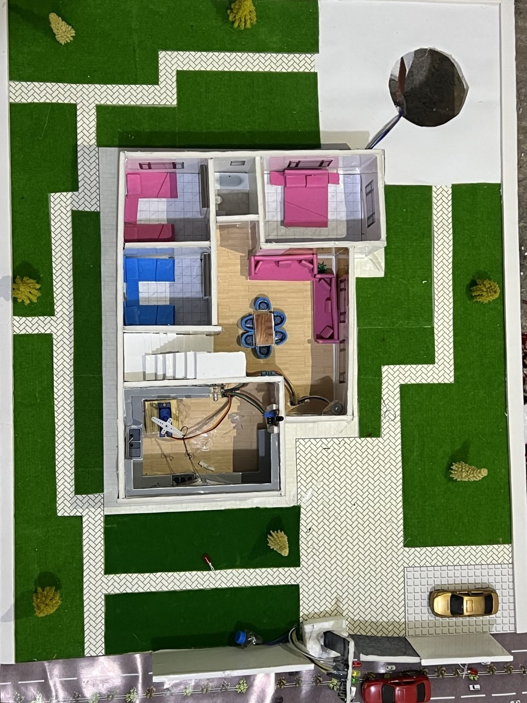
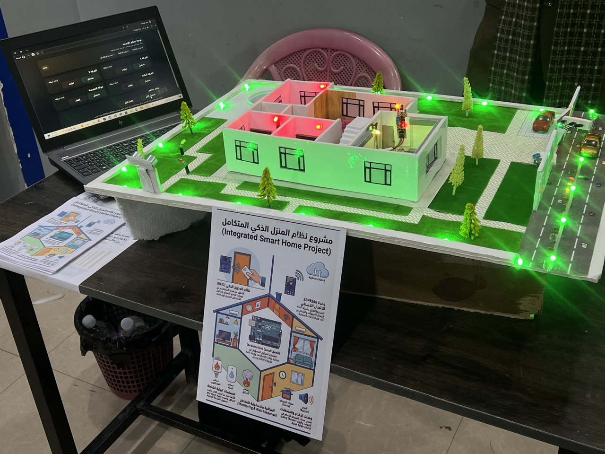
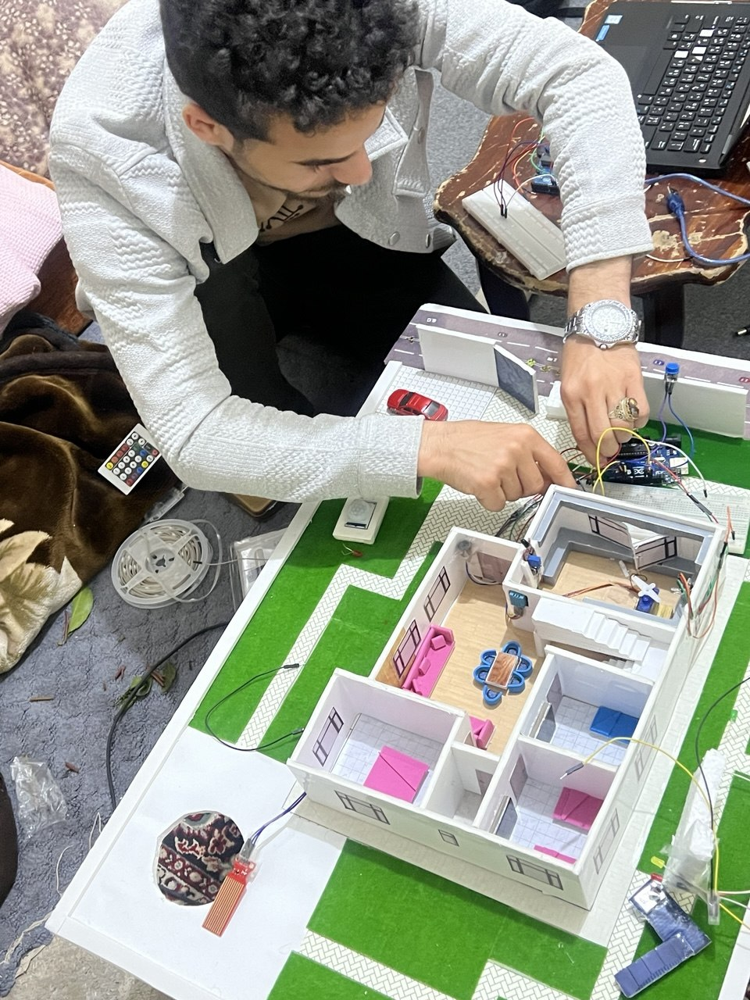
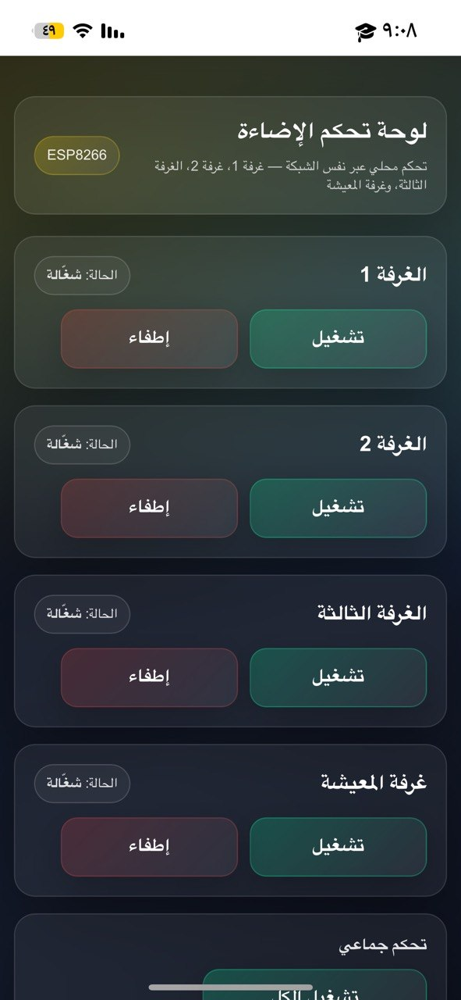
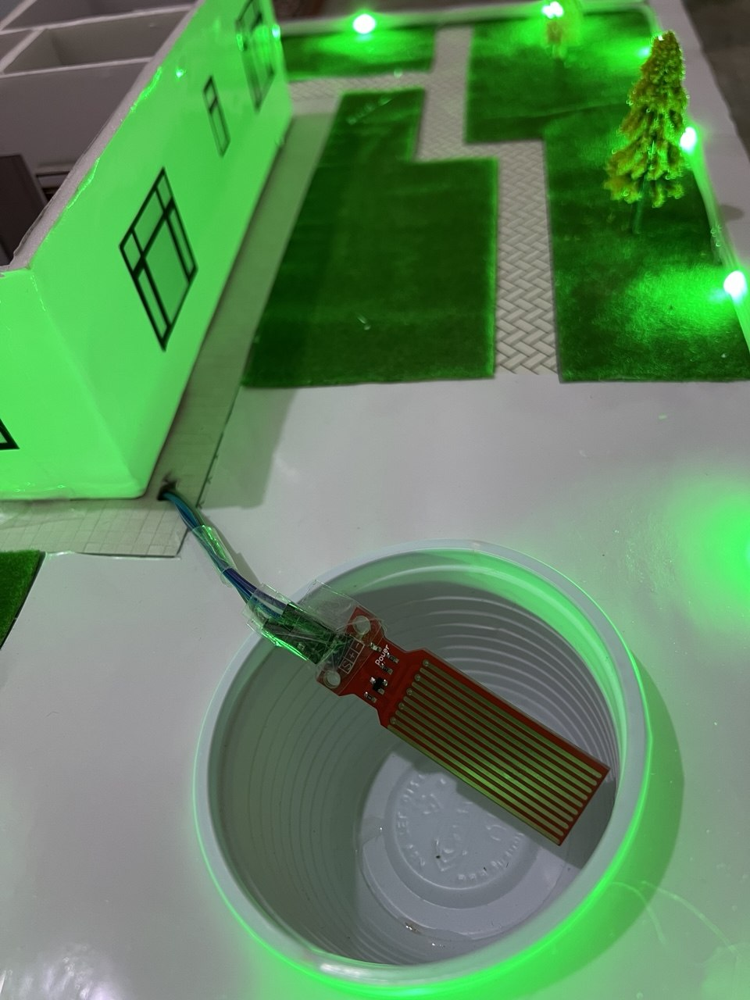
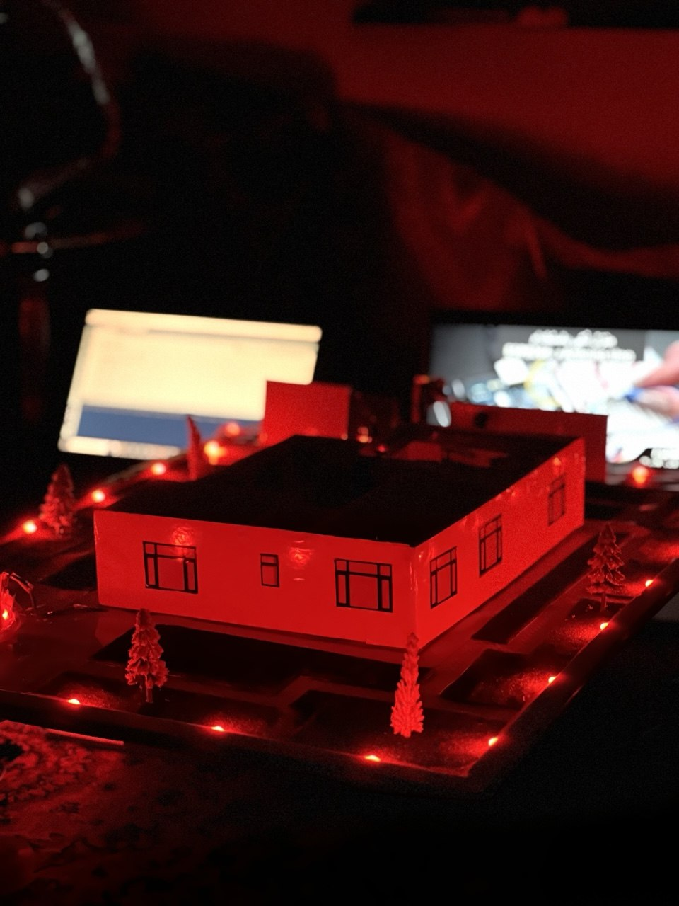
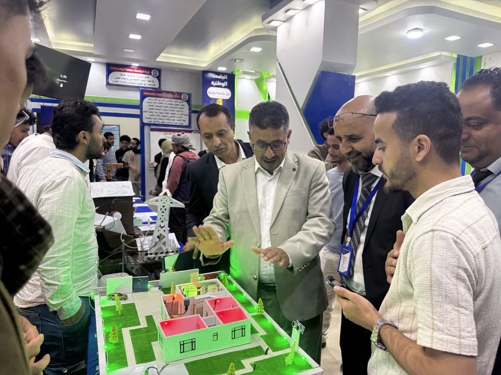

# 🏠 Smart Home Automation System

## Overview

This project presents a Smart Home Automation System developed using Arduino Uno and ESP32. It enables remote monitoring and control of home devices through a mobile application while improving safety using multiple environmental sensors.

---

## Features

- 💡 Remote light control
- 🔥 Flame detection
- 🌡️ Temperature monitoring
- 💧 Water level and leakage detection
- 📏 Ultrasonic distance measurement
- 🔔 Automatic alarm system
- 📱 Mobile monitoring and control
- 📡 Wi-Fi communication using ESP32

---

## Hardware Components

- Arduino Uno
- ESP32
- Flame Sensor
- Temperature Sensor
- Water Sensor
- Ultrasonic Sensor
- Buzzer
- LEDs
- Relay Module

---

## Software & Technologies

- Arduino IDE
- C++
- ESP32
- Internet of Things (IoT)
- Embedded Systems

---
## Project Gallery

### Smart Home Prototype


### Hardware Setup


### Development Process


### Mobile Dashboard


### Smart Lighting Control


### Water Level Monitoring


### Project Exhibition


### Project Presentation

## Project Presentation

The Smart Home Automation System was presented at the University Internet of Things (IoT) Exhibition, where it was demonstrated to faculty members, visitors, and university leadership.

---

## Repository Structure

```
Arduino/
Images/
Presentation/
README.md
```
